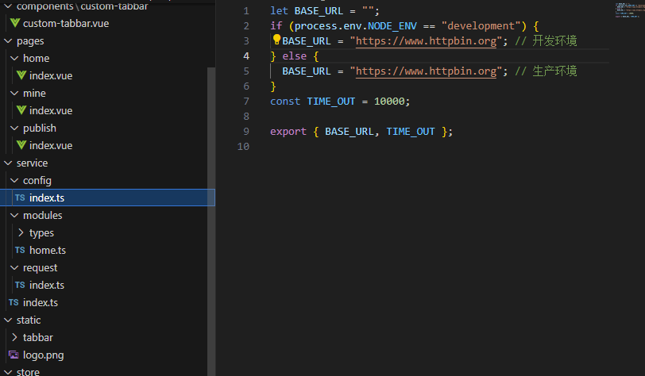
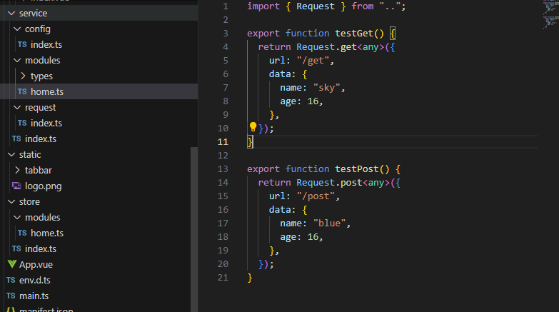
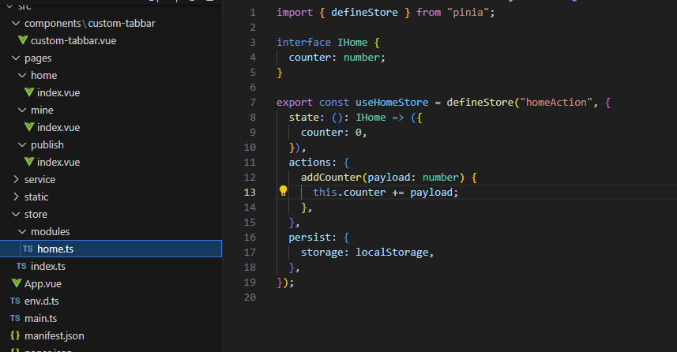
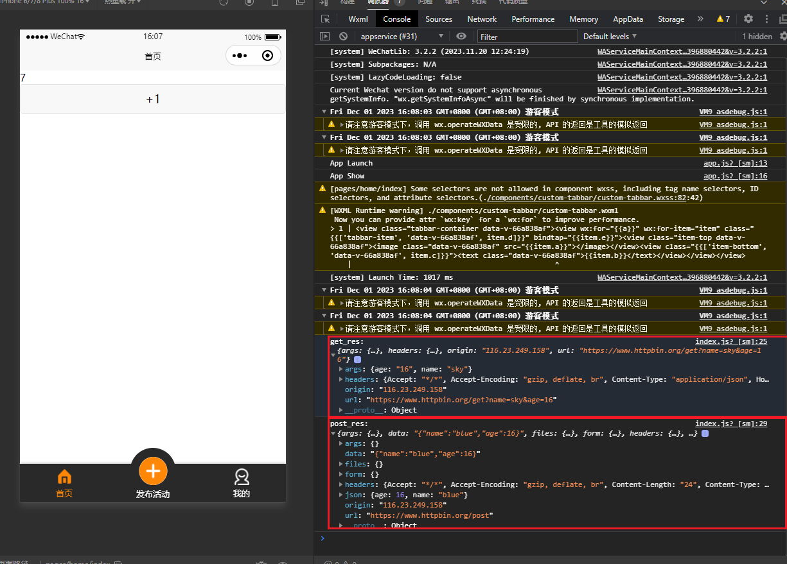
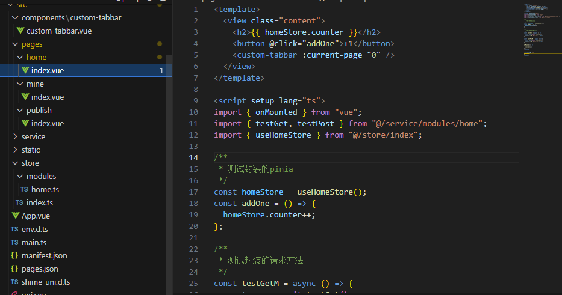
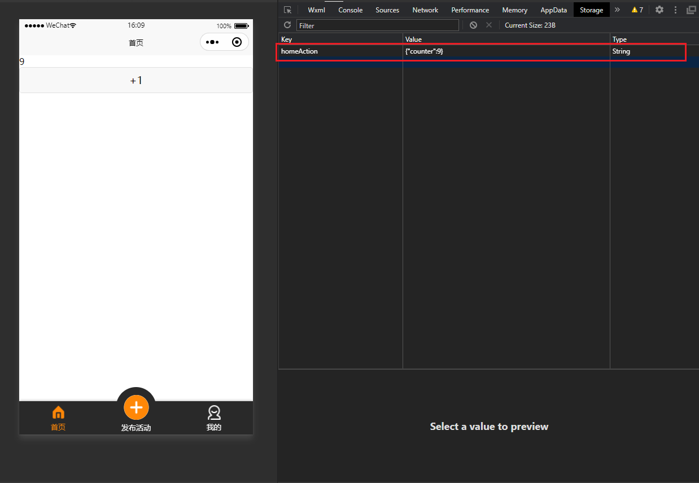
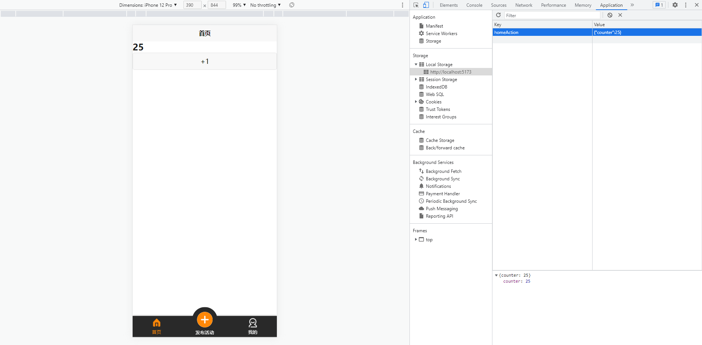

# uniapp-template

## 介绍

uniapp 集成模板，使用的时`cli`搭建的 uniapp，封装了`请求`、`pinia`跟 pinia 的`持久化`，使用`sass`预处理器。项目结构分配合理，可以开箱即用（为了多样性，所以不集成特定的 ui 组件库在里面，需要导入自己需要使用的 ui 组件库），更好的直接从平时开发 vue 直接投入开发 uniapp 应用，更加专注于页面业务，从而减少项目开发前的一些配置工作，里面也添加了常见的中间按钮突出的布局，大家可以进行沿用或者替换掉

## 开发语言

[Vue3](https://cn.vuejs.org/) + [Typescript](https://www.typescriptlang.org/)

## 项目结构
```
├─components  // 自定义组件
│  └─custom-tabbar // 自定义的tabbar,可实现中间凸起效果
├─pages 
│  ├─home // 业务页面
│  ├─mine // 业务页面
│  └─publish // 业务页面
├─service
│  ├─config // 配置请求的 baseurl 跟 timeout
│  ├─modules // 统一管理各个页面的请求封装接口
│  │  └─types // 各个请求的ts类型声明可以放在这里
│  └─request // 封装的请求
├─static
│  └─tabbar // 存放tabbar的图片
└─store
    └─modules // 创建基于 pinia 的 store,已进行可持久化
```
> `/pages/home/index.vue`页面写着了各个集成使用的测试例子，方便大家查看拉取下来安装完依赖后看看是否集成成功

## 以下是页面功能跟测试例子的截图









## 自定义配置

[Vite 配置参考](https://vitejs.dev/config/).

## 第一步：安装依赖

```sh
yarn install
```
## 第二步：删掉README.Images文件夹
（用于README.md的截图展示说明，对项目无作用）

## 第三步：编译和热重载开发

```json
"dev:app": "uni -p app",
"dev:app-android": "uni -p app-android",
"dev:app-ios": "uni -p app-ios",
"dev:custom": "uni -p",
"dev:h5": "uni",
"dev:h5:ssr": "uni --ssr",
"dev:mp-alipay": "uni -p mp-alipay",
"dev:mp-baidu": "uni -p mp-baidu",
"dev:mp-jd": "uni -p mp-jd",
"dev:mp-kuaishou": "uni -p mp-kuaishou",
"dev:mp-lark": "uni -p mp-lark",
"dev:mp-qq": "uni -p mp-qq",
"dev:mp-toutiao": "uni -p mp-toutiao",
"dev:mp-weixin": "uni -p mp-weixin",
"dev:quickapp-webview": "uni -p quickapp-webview",
"dev:quickapp-webview-huawei": "uni -p quickapp-webview-huawei",
"dev:quickapp-webview-union": "uni -p quickapp-webview-union",
"build:app": "uni build -p app",
"build:app-android": "uni build -p app-android",
"build:app-ios": "uni build -p app-ios",
"build:custom": "uni build -p",
"build:h5": "uni build",
"build:h5:ssr": "uni build --ssr",
"build:mp-alipay": "uni build -p mp-alipay",
"build:mp-baidu": "uni build -p mp-baidu",
"build:mp-jd": "uni build -p mp-jd",
"build:mp-kuaishou": "uni build -p mp-kuaishou",
"build:mp-lark": "uni build -p mp-lark",
"build:mp-qq": "uni build -p mp-qq",
"build:mp-toutiao": "uni build -p mp-toutiao",
"build:mp-weixin": "uni build -p mp-weixin",
"build:quickapp-webview": "uni build -p quickapp-webview",
"build:quickapp-webview-huawei": "uni build -p quickapp-webview-huawei",
"build:quickapp-webview-union": "uni build -p quickapp-webview-union",
"type-check": "vue-tsc --noEmit"
```